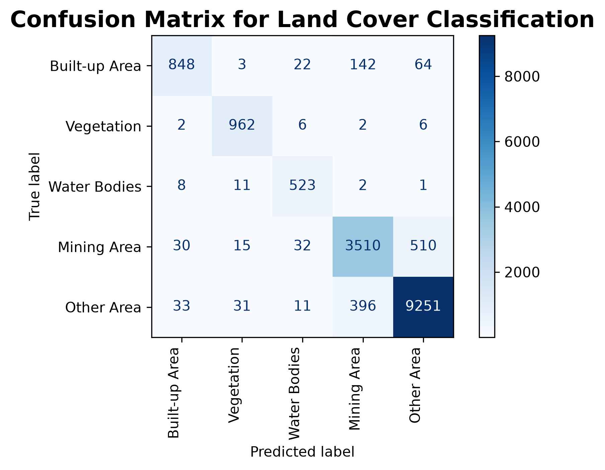

# Satellite Image Classification Using Machine Learning Techniques


## Overview

This project focuses on land-cover classification and analysis of Landsat 9 satellite imagery for the Jodhpur region, Rajasthan, India, using Geographic Information System (GIS) techniques and Machine Learning algorithms.

The workflow covers the complete remote sensing pipeline including satellite data acquisition, preprocessing, Area of Interest (AOI) extraction, NDVI generation, supervised and unsupervised image classification, accuracy assessment, post-processing, and comparative analysis using the Semi-Automatic Classification Plugin (SCP) in QGIS.

The project is being developed as part of a research internship on Remote Sensing, GIS, and Machine Learning.

### Final Land Cover Map

<p align="center">
  
</p>

## Objectives

- Download and preprocess Landsat 9 satellite imagery.
- Create the Area of Interest (AOI).
- Perform study area subsetting.
- Generate True Color and False Color Composite images.
- Generate NDVI for vegetation analysis.
- Perform supervised land-cover classification.
- Perform unsupervised land-cover classification.
- Generate land-cover statistics and thematic maps.
- Evaluate classification accuracy.
- Compare supervised and unsupervised classification techniques.
- Compare QGIS and Python implementations.

## Study Area

**Location:** Jodhpur, Rajasthan, India

The study area contains diverse land-cover types including:

- Built-up Area
- Vegetation
- Water Bodies
- Mining Area
- Other Area / Barren Land

The diversity of these land-cover classes makes the region suitable for supervised and unsupervised image classification.

## Dataset

**Satellite**

- Landsat 9 OLI/TIRS

**Source**

- USGS Earth Explorer

**Raw Data**

[Download Raw Dataset](https://drive.google.com/drive/folders/15g_Pc1WvXukniYDe2-pWzDZiFauS3iKF?usp=sharing)

**Spatial Resolution**

30 m

**Coordinate Reference System**

WGS 84 / UTM Zone 43N (EPSG:32643)


## Software & Tools

### GIS & Remote Sensing

- QGIS
- Semi-Automatic Classification Plugin (SCP)

### Programming Language

- Python

### Python Libraries


### Development Environment

- Jupyter Notebook
- Visual Studio Code


## Machine Learning Techniques Used

### Supervised Classification

- Maximum Likelihood Classification
- Random Forest Classification

### Unsupervised Classification

- K-Means Clustering


## Project Workflow

The project implements the complete land-cover classification workflow using both **QGIS (Semi-Automatic Classification Plugin)** and **Python**. Both implementations follow a similar methodology while leveraging their respective strengths for geospatial analysis and machine learning.

### QGIS Implementation

The QGIS workflow was developed using the Semi-Automatic Classification Plugin (SCP) to perform satellite image preprocessing, supervised and unsupervised land-cover classification, post-processing, and accuracy assessment.

<p align="center">
  
</p>

*Figure: Complete QGIS workflow implemented in this project.*

The workflow includes Landsat 9 preprocessing, AOI extraction, RGB and False Color Composite (FCC) generation, NDVI computation, ROI collection, spectral signature analysis, Maximum Likelihood, Random Forest, and K-Means classification, accuracy assessment, post-processing, cross-classification, and final land-cover map generation.

### Python Implementation

The Python implementation is available in [Python/Notebooks/landcover_classification.ipynb](Python/Notebooks/landcover_classification.ipynb).

The workflow includes:

1. Load Landsat 9 spectral bands.
2. Generate True Color Composite (RGB).
3. Generate False Color Composite (FCC).
4. Calculate NDVI.
5. Load training and validation ROIs.
6. Extract training samples from the raster.
7. Train the Random Forest classifier.
8. Generate the land-cover classification raster.
9. Evaluate classification accuracy using validation ROIs.
10. Export the classified raster, visualizations, trained model, and accuracy assessment results.


## Project Structure

```text
Satellite Image Classification Using Machine Learning Techniques
│
├── README.md
├── Python/
│   ├── Notebooks/
│   │   └── landcover_classification.ipynb
│   └── Outputs/
│       ├── Classification/
│       ├── Models/
│       ├── NDVI/
│       └── RGB_Composite/
│
├── QGIS Project/
│   ├── Jodhpur_Project.qgz
│   ├── AOI/
│   ├── Classification/
│   │   ├── Accuracy_Assessment/
│   │   ├── Classification_Output/
│   │   │   ├── CrossClassification/
│   │   │   ├── KMeans/
│   │   │   ├── MaximumLikelihood/
│   │   │   └── RandomForest/
│   │   ├── Classifier/
│   │   ├── PCA/
│   │   ├── Spectral_Signatures/
│   │   ├── Training_Data/
│   │   └── Validation_Data/
│   │
│   ├── Maps/
│   ├── NDVI/
│   ├── RGB_Composites/
│   └── Subset_Data/
│
├── Raw Data/
└── Report/
```

## Implemented Outputs

- Area of Interest (AOI)
- Study Area Subset
- True Color Composite (RGB)
- False Color Composite (FCC)
- Normalized Difference Vegetation Index (NDVI)
- Spectral Signature Analysis
- Maximum Likelihood Classification Map
- Random Forest Classification Map
- K-Means Classification Map
- Sieve Filtered Classification Map
- Classification to Vector Conversion
- Cross-Classification Analysis
- Land-Cover Statistics
- Confusion Matrix
- Accuracy Assessment
- Classification Report
- Publication-Quality Maps

### True Color Composite vs False Color Composite

| True Color Composite | False Color Composite |
|------------|-------------|
|  |  |

### NDVI Map

<p align="center">
  
</p>

### Land-Cover Classification Results

| Maximum Likelihood | Random Forest |
|--------------------|---------------|
|  |  |

### Confusion Matrix

<p align="center">
  
</p>


## Land-Cover Classes

The classified map contains five land-cover classes:

| Class ID | Land-Cover Class |
|----------|------------------|
| 1 | Built-up Area |
| 2 | Vegetation |
| 3 | Water Bodies |
| 4 | Mining Area |
| 5 | Other Area / Barren Land |


## Classification Techniques Comparison

| Method | Category | Implementation |
|---------|----------|----------------|
| Maximum Likelihood | Supervised Statistical Classification | QGIS (SCP) |
| Random Forest | Supervised Machine Learning | QGIS (SCP) & Python (Scikit-learn) |
| K-Means | Unsupervised Machine Learning | QGIS (SCP) |


## Results

The project successfully implemented land-cover classification using both classical statistical and machine learning approaches. The classification performance of the implemented methods is summarized below.

| Classification Method | Platform | Overall Accuracy |
|-----------------------|----------|----------------:|
| Maximum Likelihood | QGIS (SCP) | 87.61% |
| Random Forest | QGIS (SCP) | 92.05% |
| Random Forest | Python (Scikit-learn) | 91.92% |

The results demonstrate that all implemented classification methods achieved high overall accuracy for the Jodhpur study area. Among the evaluated methods, the QGIS-based Random Forest classifier achieved the highest classification accuracy, while the Python implementation successfully reproduced the complete Random Forest classification workflow using open-source geospatial and machine learning libraries. 

## QGIS vs Python Comparison

This project implements land-cover classification using both **QGIS (Semi-Automatic Classification Plugin)** and **Python (Scikit-learn)**. While both workflows follow similar preprocessing and classification steps, they differ in terms of automation, flexibility, and implementation.

### Feature Comparison

| Feature | QGIS (SCP) | Python |
|---------|:----------:|:------:|
| AOI Extraction | ✅ | ✅ |
| RGB & FCC Generation | ✅ | ✅ |
| NDVI Generation | ✅ | ✅ |
| Random Forest Classification | ✅ | ✅ |
| Accuracy Assessment | ✅ | ✅ |
| Interactive GUI | ✅ | ❌ |
| Workflow Automation | Partial | ✅ |
| Reproducible Code | Partial | ✅ |
| Batch Processing | Partial | ✅ |

### Random Forest Performance

| Metric | QGIS | Python |
|--------|------:|------:|
| Overall Accuracy | 92.05% | 91.92% |
| Kappa Coefficient | 0.9199 | 0.8595 |
| Number of Trees | 200 | 300 |

### Summary

The QGIS workflow provides a user-friendly graphical environment for interactive remote sensing analysis, while the Python implementation offers a fully reproducible and customizable machine learning workflow. Both implementations successfully generated land-cover classification maps, NDVI products, and accuracy assessment metrics. The Python workflow further enables easier automation, parameter tuning, and integration into larger geospatial analysis pipelines.


## Repository Status

### Completed

- Landsat Data Download
- AOI Generation
- Study Area Subsetting
- RGB & False Color Composite
- NDVI Generation
- ROI Creation
- Maximum Likelihood Classification
- Random Forest Classification
- K-Means Clustering
- Accuracy Assessment
- Classification Report
- Sieve Filtering
- Classification to Vector
- Cross Classification
- Complete QGIS Workflow
- Python Land Cover Classification Workflow
- Python Accuracy Assessment Workflow
- Comparative Analysis (QGIS vs Python)

### In Progress

- Final Report


## References

- USGS Earth Explorer
- Landsat 9 Data Users Handbook
- QGIS Documentation
- Semi-Automatic Classification Plugin Documentation
- Scikit-learn Documentation
- Rasterio Documentation
- GeoPandas Documentation


## Author

**Mohit Gaur**

B.E. Information Technology

MBM University, Jodhpur


## License

This project is intended for educational, research, and internship purposes.

---

If you found this project useful, consider giving it a star ⭐